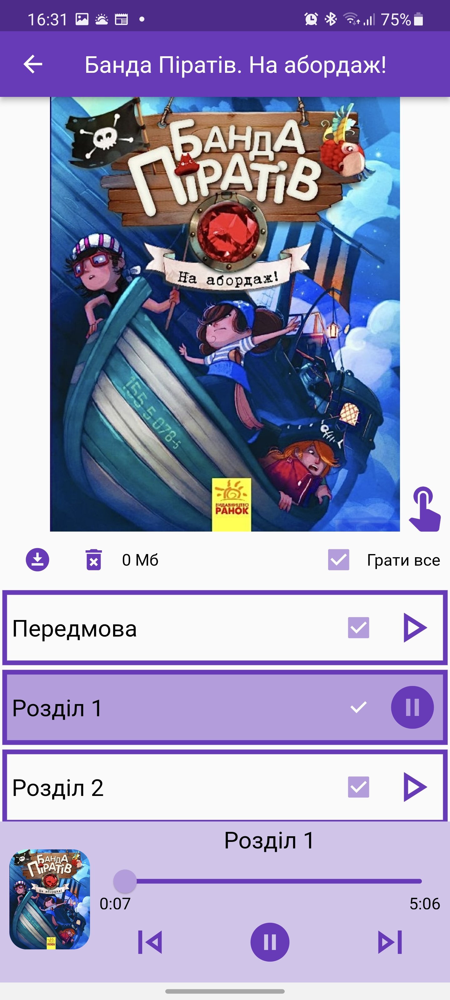
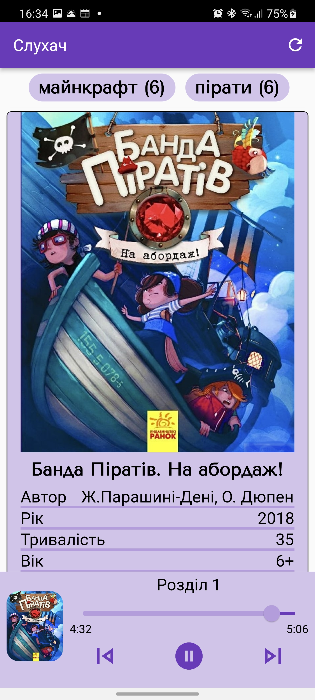
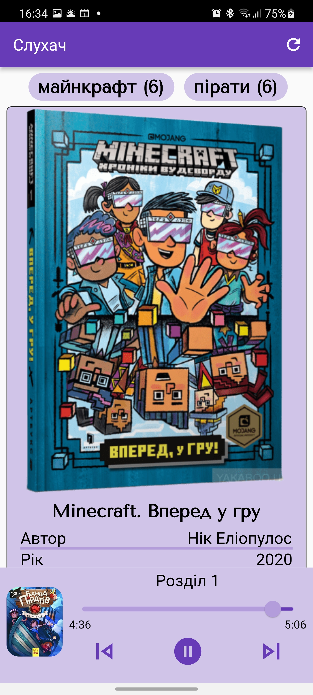

# Sluha.ch

Sluhach is a native client for the https://sluha.ch portal. It allows you to listen to audiobooks created by my wife. Books are for kids 6-10 years old and about what they love: Minecraft and Pirates! We have plans to make more audiobooks, so stay tuned! All the books are in Ukrainian :)

## Links to download
The Play Store rejects the app cause there is "Minecraft" word everywhere in my catalogs so the only way to try is to download APK.

Go to Releases page of this repo and download the APK.

## Technical Info

The whole app is built with [Flutter](https://flutter.dev) and a couple plugins:

- [Just Audio](https://pub.dev/packages/just_audio) for playing large music files
- [Just Audio Background](https://pub.dev/packages/just_audio_background) for playing from Notifications
- [Audio Session](https://pub.dev/packages/audio_session) for reacting to interruptions

## Online/offline
The app allows to sync with the only catalog (required on first launch). Then it syncs only when asked by user. Books can be downloaded separately if needed for offline listening (while driving, etc).

## Testing

There are no unit tests cause there is nothing to test :) Good luck testing audio playback if you want lol.

## State management
I do not use any hyped state management approaches or libs. I always thought that setState and rxdart was enough to make even such sophisticated application like Music Player. This application is a proof that all your state management libs are just exploded egos of certain engineers who advertise their libs.

### How the app is architectured

As there can be only one Music Player for each application (by Android design) I use it as a singleton to access different streams such as:
- playback stream
- progress stream
- download file changes stream
- etc

So anywhere in my widgets I can access Player.instance.playbackChanges and update my UI when needed.
And connect UI user actions with the methods from the same Player instance.

This approach is simple and quite powerfull as there is literaly zero abstractions between music state UI and data.

## UI

The UI supports white and dark themes.

As the books are only available in Ukrainian language I decided to have only one langugage for the interface as well.

The UI supports landscape and portrait mode and even works on large displays like Galaxy Tab S7.

# Screenshots

## Book view

## Catalog view

## Another book view
